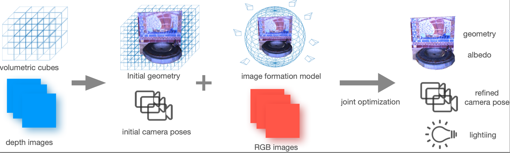

## <b>High-Quality RGB-D Reconstruction via Multi-View Uncalibrated Photometric Stereo and Gradient-SDF</b>
---
Enable detailed RGB-D data 3D reconstruction. Jointly estimate camera pose, geometry, albedo and environment lighting under natural light or point-light-source.



---
# clone repository
```
git clone https://github.com/Sangluisme/PSgradientSDF.git
```
please use
```
git submodule update --init --recursive
```
to pull our dependency.

# code structure
``` 
cpp (basic code folder)
|---include
|---third
|---voxel_ps
|     |---bin
|     |---src
|     |---CMakeLsits.txt
|---CMakeLists.txt

config (example config files)
|---config.json
|---...

data (demo data folder)
|---demo_data1
|---demo_data2

results (default results save path)
|---...

```
# setup
please create a `build` folder under the `cpp/` folder path then do 
```
cd cuild
cmake ..
make 
```
it will build a binary file under the path `cpp/voxel_ps/bin/`.

# usage
```
cd ./cpp/voxel_ps/bin/
./voxelPS --config_file <your config file path>
```

# config file
All the parameters you can control are listed in the example config files in the `config` folder. 
Here is some explanation of the parameters.

- **input**: data folder path
- **output**: results saving path
- pose filename: ground true pose or pre-calculated pose file name under input path (optional)
- **datatype**: support `tum` (TUM_RGBD sequence), `synth`, `multiview` differences explained in next section
- first: start frame number
- last: end frame number
- voxel size: voxel size in `cm` (choose a larger one if the algorithm is too slow)
- sharpness threshold: criteria of select the key frame
- **model type**: `SH1`, `SH2`, `LED` (1st, 2nd spherical harmonics, point-light-source)
- reg albedo: regularizer for albedo (set to 0)
- reg norm: Eikonal regularizer
- reg laplacian: regularizer for distance laplacian (set to 0)
- lambda: loss function parameters
- --light: bool if update light
- --albedo: bool if update albedo
- --distance: bool if update SDF distance
- --pose: bool if update pose

please note the **bold** parameters are required, others are optional.

# data type
**the main difference of each data type is the structure of the data folder**
General requirement is:
- contain depth and rgb images, together with `intrinsics.txt` in the same folder. 
- If the pose is unkown, the images should like a video sequence which allow camera tracking, otherwise initial camera pose file should be provided. 

`tum` -- TUM_RGBD (please refer to https://vision.in.tum.de/data/datasets/rgbd-dataset/download for detail)

should have the structure 
```
data
|---depth (folder)
|     |---depth_timestamp1.png
|     |---depth_timestamp2.png
|     |---...
|
|---rgb (folder)
|     |---rgb_timestamp1.png
|     |---rgb_timestamp2.png
|     |---...
|
|---depth.txt
|---rgb.txt
|---associated.txt
|---intrinsics.txt

```
`multiview` -- intrinsic3d data should have the structure (some multi view data has too large baseline, thus initial poses are needed)
```
data
|---color0000001.png
|---color0000002.png
|---color0000003.png
|---...
|---depth0000001.png
|---depth0000001.png
|---depth0000001.png
|---...
|---intrinsics.txt
|---pose.txt 
```
`synth` -- the synthetic data or point-light-source data which is recorded using the set-up mentioned in the paper

```
data
|---depth
|     |---001.png
|     |---002.png
|     |---003.png
|     |---...
|---rgb
|     |---001.png
|     |---003.png
|     |---003.png
|     |---...
|---intrinsics.txt
```
**To use your own data, just convert your data to either one of the structure and specify the corresponding data type in the `config.json` file**.

# trouble shooting

- **compile error of `Sophus`**: we use an older version of sophus, just commit back to the version shows in the git repository.
- **too slow/out of memory**: disable `upsampling` in `config.json` or increse the voxel size.
